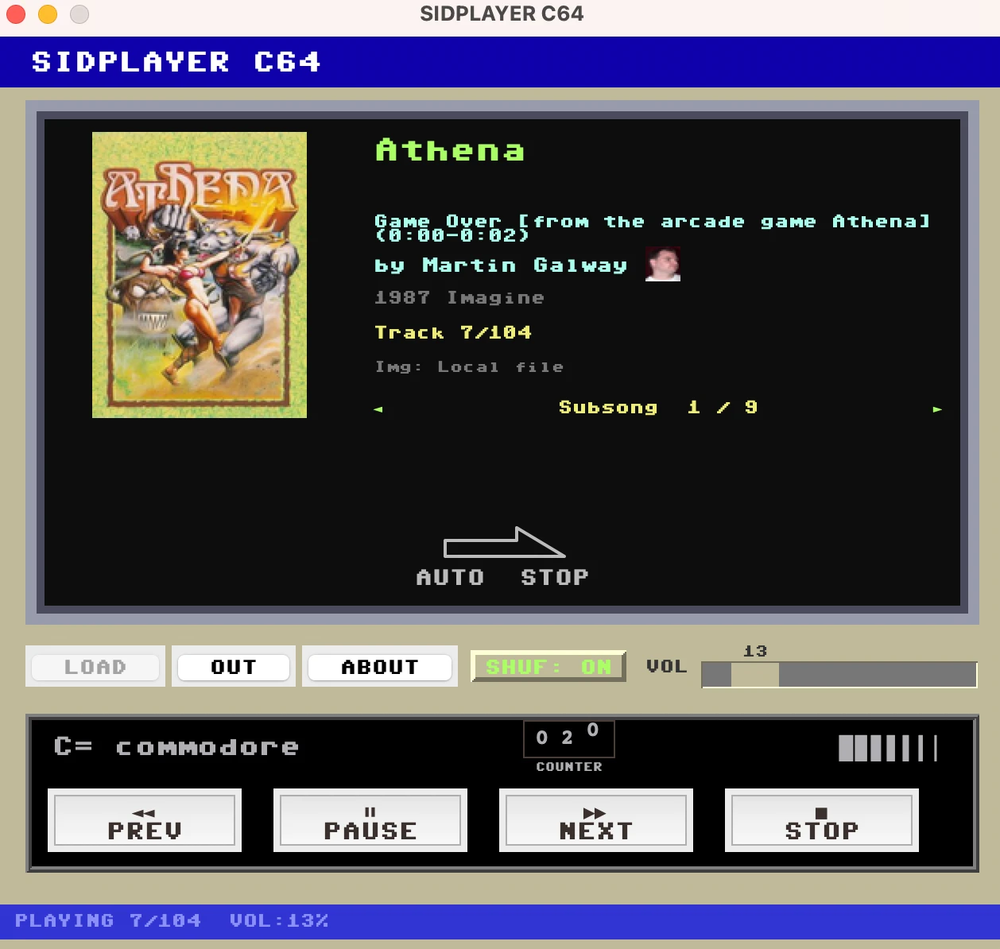
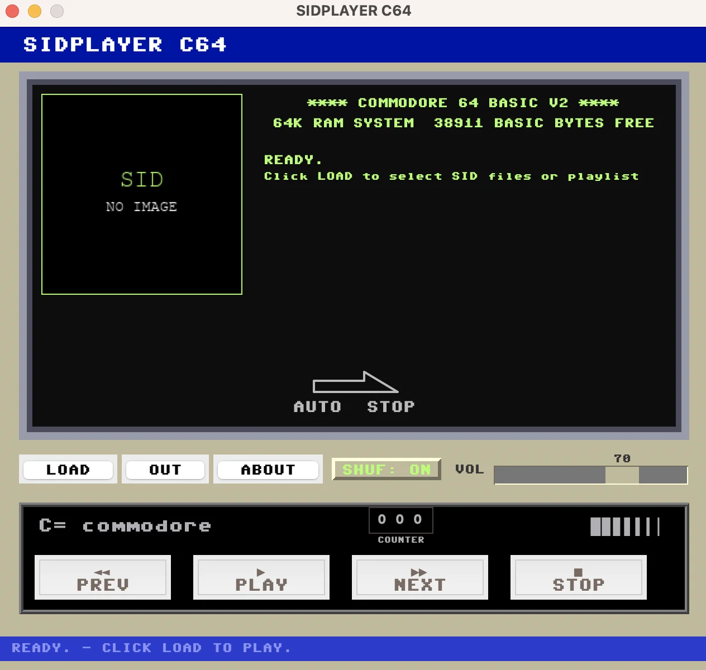
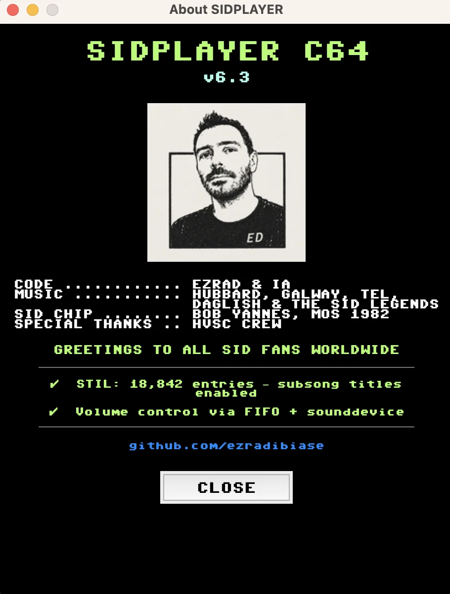

<div align="center">

# SIDPlayer C64

**Quarant'anni dopo, il SID suona ancora.**

Un player desktop per i brani `.sid` del Commodore 64, con l'interfaccia ispirata
al Datasette VC-1530: cover dei giochi, playlist HVSC, contatore a nastro
e integrazione con Touch Bar e Control Center su macOS.




*In riproduzione: Martin Galway, "Athena" (1987 Imagine) — subsong 1 di 9, con cover art e foto dell'autore.*

</div>

---

## Indice

- [Quick start](#quick-start)
- [Perché SIDPlayer](#perché-sidplayer)
- [Caratteristiche](#caratteristiche)
- [Configurazione](#configurazione)
- [Playlist](#playlist)
- [Interfaccia](#interfaccia)
- [Now Playing su macOS](#now-playing-macos)
- [Compilare l'app bundle (macOS)](#compilare-lapp-bundle-macos)
- [Risoluzione problemi](#risoluzione-problemi)
- [STIL](#stil-sid-tune-information-list)
- [Roadmap](#roadmap)
- [Contribuire](#contribuire)
- [Crediti](#crediti)
- [Licenza](#licenza)

---

## Quick start

```bash
# 1. Il motore audio
brew install sidplayfp                # macOS
# sudo apt install sidplayfp          # Linux (Debian/Ubuntu)

# 2. Il player
git clone https://github.com/ezradibiase/sid_player.git
cd sid_player
pip install -r requirements.txt

# 3. Musica.
python3 sidplayer.py
```

Clicca **LOAD**, scegli un file `.sid` (o una playlist), premi **PLAY**. Fine.

In alternativa, trascina uno o più file `.sid` (o un'intera cartella) direttamente
sulla finestra: la riproduzione parte da sola.

> ⚠️ SIDPlayer è **testato e supportato pienamente su macOS**. Il supporto per Linux e
> Windows è in **beta** — il codice ha fallback per quelle piattaforme, ma non è mai stato
> testato in profondità. Segnala problemi su [GitHub Issues](https://github.com/ezradibiase/sid_player/issues).

Su **Windows**: scarica sidplayfp da [SourceForge](https://sourceforge.net/projects/sidplay-residfp/),
poi doppio clic su `launchers/start_sidplayer.bat`. Su **macOS** puoi anche rendere
eseguibile `launchers/start_sidplayer.command` e aprirlo dal Finder.

Il font [C64 Pro Mono](https://github.com/mborgbrant/c64-pro-mono) è opzionale ma
consigliato: senza, viene usato Courier come fallback.

---

## Perché SIDPlayer

Il SID (MOS 6581/8580) è il chip audio del Commodore 64, e la
[High Voltage SID Collection](https://www.hvsc.c64.org/) ne conserva oltre 50.000 brani.
Per ascoltarli esistono già ottimi strumenti — emulatori, player da riga di comando,
servizi online come DeepSID.

Questo è semplicemente il player che ho costruito per il mio uso personale: riproduce
i `.sid` con `sidplayfp`, mostra la cover del gioco e i titoli dei subsong dal database
STIL, si integra con i controlli multimediali di sistema, e ha la faccia del
registratore a cassette con cui quei brani si caricavano nel 1985 — perché mi ci
sono affezionato e volevo un player che gli somigliasse.

---

## Caratteristiche

**Riproduzione**
- File `.sid` (PSID/RSID) via `sidplayfp`, con durate dal database HVSC Songlengths
- Navigazione **subsong** (◄ / ►) con lettura del default song dall'header SID
- Playlist personalizzate e in **formato standard HVSC** (anche liste "ranked" come le Top100)
- **Drag & drop**: trascina file `.sid` o intere cartelle sulla finestra per caricarli e avviare subito la riproduzione
- **Shuffle** attivabile/disattivabile a runtime (bottone SHUF)
- Controllo volume in tempo reale, mute, pausa/ripresa
- Selezione del device di output audio, incluse casse Bluetooth

**Estetica Datasette**
- Interfaccia ispirata al **Commodore Datasette VC-1530**: finestrella con bezel
  metallico, decorazione AUTO STOP, contatore a nastro a 3 cifre animato
- Cover del gioco da **IGDB** e **RAWG** (opzionale, con API key)
- Titoli dei subsong dal database **STIL**
- Boot screen easter egg in stile BASIC V2 all'avvio 😉

**Integrazione macOS**
- **Control Center**: titolo e artista nel widget musica
- **Touch Bar**: play/pause, traccia precedente/successiva
- **Tasti F-media** (F7/F8/F9) e **Siri**

---

## Configurazione

Il file di configurazione viene creato automaticamente nella posizione canonica
per la piattaforma:

| Sistema | Percorso |
|---------|----------|
| macOS | `~/Library/Application Support/SIDPlayer/sidplayer.cfg` |
| Linux | `~/.config/SIDPlayer/sidplayer.cfg` |
| Windows | `%APPDATA%\SIDPlayer\sidplayer.cfg` |

Per personalizzarlo, copia il file di esempio nella posizione corretta:

```bash
# macOS
cp sidplayer.cfg.example ~/Library/Application\ Support/SIDPlayer/sidplayer.cfg
```

Struttura di `sidplayer.cfg`:

```ini
[paths]
# Directory dove salvare le copertine scaricate
images_dir = ~/Pictures/SIDPlayer

# File playlist caricato automaticamente all'avvio (opzionale, vuoto di default)
playlist_file =

# Root locale della collezione HVSC, necessaria solo per playlist con
# path HVSC-relativi (vedi sezione Playlist)
hvsc_root =

# Collezione GB64 locale (opzionale), stesso approccio usato da DeepSID:
# match preciso tramite il database invece di indovinare dal nome file
# (vedi sezione "Copertine da GB64" più sotto).
gb64_boxart_path =
gb64_mdb_path =

# Percorso STIL.txt (lascia vuoto per ricerca automatica)
stil_path =

[api]
# RAWG.io API Key (opzionale)
rawg_api_key =

# IGDB Credentials (opzionale, consigliato per le copertine)
igdb_client_id =
igdb_access_token =

[player]
# Comando sidplayfp (deve essere nel PATH)
sidplay_cmd = sidplayfp

# Ordine casuale (true) o sequenziale (false) delle playlist
shuffle = true

[window]
width = 640
height = 580
resizable = false
```

### Ottenere le API key (opzionale)

Senza API key il player funziona normalmente, ma non scarica le copertine dei giochi.

**IGDB** (consigliato):
1. Vai su https://dev.twitch.tv/console/apps e crea un'applicazione
2. Copia **Client ID** e genera un **Access Token**
3. Inseriscili in `sidplayer.cfg`

**RAWG.io** (alternativa):
1. Vai su https://rawg.io/apidocs e richiedi una API key gratuita
2. Inseriscila in `sidplayer.cfg`

### Copertine da GB64 (opzionale, consigliato)

Oltre a IGDB/RAWG, SIDPlayer può usare una collezione [GB64](https://gb64.com) locale per le
copertine, con lo stesso approccio di [DeepSID](https://deepsid.chordian.net/): match preciso
tramite il database del gioco, invece di indovinare dal nome file. Nessuna chiamata di rete
quando la copertina è disponibile in locale, e niente più copertine sbagliate per giochi con
nomi simili.

**Cosa serve, in breve:**

| Cosa | Per cosa serve | Dove trovarlo |
|---|---|---|
| `mdbtools` installato (comando `mdb-export` nel PATH) | Leggere il database Access di GB64 | `port`/`brew`/`apt install mdbtools` |
| `innoextract` (solo per estrarre il database, poi non serve più) | Il database si scarica come installer `.exe` Windows | `port`/`brew install innoextract` |
| File `GBC_v19.mdb` | Il database GB64 vero e proprio | [gb64.com/downloads.php](https://gb64.com/downloads.php), sezione "GB64 v19 Database" |
| Cartella con le immagini `Cover` | Le copertine effettive | [archive.org/details/gb64v19](https://archive.org/details/gb64v19), file `Extras/Cover.zip` (~2 GB) |

Senza uno di questi (o se `mdbtools` non è installato), SIDPlayer salta semplicemente questo
passaggio e cerca online come prima — nessun errore, solo meno copertine trovate in locale.

**1. Installa mdbtools e innoextract:**
```bash
# macOS (MacPorts)
sudo port install mdbtools innoextract
# Homebrew
brew install mdbtools innoextract
# Linux (Debian/Ubuntu)
sudo apt install mdbtools innoextract
```

**2. Scarica ed estrai il database** da [gb64.com/downloads.php](https://gb64.com/downloads.php)
("GB64 v19 Database", ~7 MB) — è un installer Inno Setup per Windows, ma su macOS/Linux si estrae
senza eseguirlo:
```bash
innoextract gb64v19.exe
# il file che serve è dentro app/GBC_v19.mdb
```

**3. Scarica le immagini**: il pacchetto **Cover** (box art pulita, senza screenshot mischiati)
si trova nella collezione completa su [Internet Archive](https://archive.org/details/gb64v19),
dentro `Extras/Cover.zip` (~2 GB) — non nel download rapido di gb64.com, che offre solo un
pacchetto "Screenshots" misto.

**4. Configura in `sidplayer.cfg`** (consigliato tenere entrambi nella stessa cartella):
```ini
[paths]
gb64_boxart_path = ~/Pictures/SIDPlayer/Cover
gb64_mdb_path = ~/Pictures/SIDPlayer/GBC_v19.mdb
```

---

## Playlist

Crea un file di testo con un file SID per riga:

```
# I commenti iniziano con #
/percorso/assoluto/Commando.sid
/percorso/assoluto/LastNinja.sid:2
~/Music/SID/Hubbard_Rob/International_Karate.sid:1
```

Il numero dopo i due punti specifica il **subsong** (traccia). Se omesso, viene letta
la subsong di default dichiarata nell'header del file SID stesso.

Per usare una playlist come default all'avvio, imposta `playlist_file` in `sidplayer.cfg`.

### Playlist in formato standard HVSC

SIDPlayer riconosce anche il formato usato dalle liste ufficiali HVSC
(es. [Top100 di LaLa](https://www.hvsc.c64.org/)), dove i file sono elencati con path
**relativi alla root della collezione**, senza indicazione di subsong:

```
/Galway_Martin/Wizball.sid
/Daglish_Ben/Last_Ninja.sid
```

Sono supportati anche i file con numerazione di posizione (formato "ranked"), es.:

```
  1. /Galway_Martin/Wizball.sid
  2. /Daglish_Ben/Last_Ninja.sid
```

Per farli funzionare, imposta `hvsc_root` in `sidplayer.cfg` con il percorso della tua
copia locale della collezione HVSC:

```ini
[paths]
hvsc_root = ~/Music/C64Music
```

Un path HVSC-relativo viene risolto contro `hvsc_root` solo se non esiste già come path
assoluto sul filesystem, quindi le playlist con path assoluti funzionano invariate.

> **Nota**: la struttura delle cartelle HVSC è cambiata nel tempo (le versioni recenti
> nidificano gli autori sotto `MUSICIANS/<lettera>/`). Le liste storiche come i vecchi
> Top100 potrebbero non combaciare con una copia HVSC recente senza adattare i path.

---

## Interfaccia

### Finestrella

Il pannello centrale, ispirato alla finestrella trasparente del Datasette, mostra:
- **Cover del gioco** (da IGDB o RAWG) a sinistra
- **Titolo**, subtitle STIL, **autore**, anno di rilascio e numero traccia a destra
- Cornice esterna e incavo interno colorati per richiamare il bezel metallico e lo
  sportello della cassetta del Datasette originale, con decorazione "AUTO STOP"
- Il badge Commodore nella barra di trasporto include un contatore a 3 cifre animato
  con etichetta **COUNTER**

All'avvio, prima di caricare qualsiasi cosa, la finestrella mostra una schermata di
boot in stile C64 BASIC — resta visibile finché non si carica un SID/playlist o parte
la riproduzione:



*La schermata di boot, prima cosa mostrata all'avvio: persiste finché non si carica un SID o una playlist.*

### Bottoni utility

| Pulsante | Funzione |
|----------|----------|
| **LOAD** | Carica file SID o una playlist |
| **OUT** | Seleziona il device di output audio |
| **ABOUT** | Informazioni sull'applicazione |
| **SHUF** | Attiva/disattiva l'ordine casuale della playlist (verde = attivo) |
| **VOL** | Slider volume (0–100%) |
| **M** | Mute / unmute |



*La schermata ABOUT, con crediti in stile demoscene anni '80.*

### Bottoni trasporto (stile Datasette)

| Pulsante | Funzione |
|----------|----------|
| **◄◄ PREV** | Torna al brano precedente (risuona il primo se già al primo) |
| **▶ PLAY / ⏸ PAUSE** | Avvia la riproduzione; durante il play alterna pausa e ripresa |
| **▶▶ NEXT** | Passa alla traccia successiva |
| **■ STOP** | Ferma la riproduzione |

### Navigazione subsong

I file SID possono contenere più tracce (subsong). Durante la riproduzione, se il file
ha più subsong, appare una riga con:

```
◄  Subsong  N / M  ►
```

- **◄ / ►** — passa al subsong precedente/successivo (circolare)
- **N / M** — subsong corrente su totale

Il subsong viene ricaricato istantaneamente senza perdere la posizione in playlist.
La riga scompare quando si ferma la riproduzione o se il file ha un solo subsong.

Per chiudere l'applicazione usa la **✕** del window manager (la finestra salva lo stato
correttamente).

### Selezione output audio

Il pulsante **OUT** apre un popup con tutti i device audio disponibili nel sistema.
Permette di separare l'audio del player dall'audio
di sistema. Il device selezionato viene usato dalla traccia successiva in poi.

---

## Now Playing (macOS)

Su macOS, SIDPlayer si integra con i controlli multimediali del sistema operativo:

- **Control Center** — mostra titolo e artista del brano in corso nel widget musica
- **Touch Bar** — controlli play/pause, traccia precedente e successiva
- **Tasti F-media** (F7 / F8 / F9) — controllano la riproduzione
- **Siri** — può mettere in pausa o riprendere la riproduzione

L'integrazione usa `MPNowPlayingInfoCenter` e `MPRemoteCommandCenter` del framework
Apple **MediaPlayer**, accessibile tramite PyObjC (già incluso in macOS — nessuna
dipendenza aggiuntiva richiesta).

Su Linux e Windows la funzionalità è disabilitata silenziosamente.

---

## Compilare l'app bundle (macOS)

Per creare un'app `.app` autonoma per macOS:

```bash
pip install pyinstaller
cd scripts
pyinstaller SIDPlayer.spec
```

L'app viene creata in `scripts/dist/SIDPlayer.app`.

---

## Risoluzione problemi

<details>
<summary><strong>Durata dei brani: come funziona</strong></summary>

SIDPlayer usa il flag `-os` di `sidplayfp` (single track mode): ogni brano viene suonato
**una volta sola** e poi `sidplayfp` termina automaticamente in base alla durata
registrata nell'HVSC Songlengths database.

Per farlo funzionare correttamente, scarica la HVSC (vedi sezione STIL) e imposta il
percorso del database in `~/.config/sidplayfp/sidplayfp.ini`:

```ini
[SIDPlayfp]
Songlength Database = /percorso/a/HVSC/DOCUMENTS/Songlengths.md5
```
</details>

<details>
<summary><strong>"sidplayfp not found"</strong></summary>

Installa `sidplayfp` (vedi Quick start) e verifica che sia nel PATH:
```bash
which sidplayfp
```
Se è in un percorso non standard, impostalo in `sidplayer.cfg`:
```ini
[player]
sidplay_cmd = /opt/homebrew/bin/sidplayfp
```
</details>

<details>
<summary><strong>Le copertine non vengono scaricate</strong></summary>

- Verifica che le API key siano configurate in `sidplayer.cfg`
- Controlla la connessione internet
- I log si trovano in `sidplayer_debug.log`
</details>

<details>
<summary><strong>Il font non è quello C64</strong></summary>

Installa il font **C64 Pro Mono** e riavvia l'app. Senza di esso viene usato Courier
come fallback.
</details>

<details>
<summary><strong>Log di debug</strong></summary>

```bash
tail -f sidplayer_debug.log
```
Per abilitare output verbose nel terminale:
```bash
python3 sidplayer.py -d
```
</details>

---

## STIL (SID Tune Information List)

STIL contiene titoli e note sui subsong dell'HVSC. Per usarlo:
1. Scarica la HVSC da https://www.hvsc.c64.org/
2. Imposta il percorso di `STIL.txt` in `sidplayer.cfg`, oppure mettilo in una delle
   posizioni cercate automaticamente:
   - `./STIL.txt`
   - `~/Music/HVSC/STIL.txt`
   - `~/HVSC/STIL.txt`

---

## Roadmap

- [ ] **Drag & drop** di file e playlist sulla finestra ([#3](https://github.com/ezradibiase/sid_player/issues/3))
- [ ] **Browser HVSC integrato** per esplorare la collezione dal player ([#4](https://github.com/ezradibiase/sid_player/issues/4))
- [ ] **Finestra Preferenze** (⌘,) per configurare senza editare file ([#9](https://github.com/ezradibiase/sid_player/issues/9))
- [ ] Test e supporto completo per **Linux e Windows** ([#7](https://github.com/ezradibiase/sid_player/issues/7))

La cronologia completa delle versioni è nel [CHANGELOG](CHANGELOG.md).

---

## Contribuire

Issue e pull request sono benvenute — il flusso è quello classico:

1. Apri una **issue** per discutere bug o proposta
2. Crea un branch (`feature/nome-feature` o `fix/nome-fix`)
3. Apri una **PR** verso `main`

Se usi SIDPlayer su **Linux o Windows**, ogni segnalazione è preziosa:
il supporto è in beta proprio perché mancano test sul campo.

---

## Crediti

| | |
|---|---|
| **Codice** | ezrad & IA — 2026 |
| **Musica** | Hubbard, Galway, Tel, Daglish & the SID legends |
| **Chip SID** | Bob Yannes, MOS Technology, 1982 |
| **Collezione** | [HVSC — High Voltage SID Collection](https://www.hvsc.c64.org/) |
| **Motore audio** | [sidplayfp](https://github.com/libsidplayfp/sidplayfp) |
| **Font** | [C64 Pro Mono](https://github.com/mborgbrant/c64-pro-mono) |

Altri link: [IGDB API](https://api-docs.igdb.com/) · [RAWG.io API](https://rawg.io/apidocs)

---

## Licenza

MIT — vedi [LICENSE](LICENSE).

*"Commodore" e il logo Commodore sono marchi dei rispettivi proprietari. Questo progetto
è un'opera fan indipendente e non è affiliato, approvato o connesso a Commodore Business
Machines Ltd o a qualsiasi entità correlata.*
